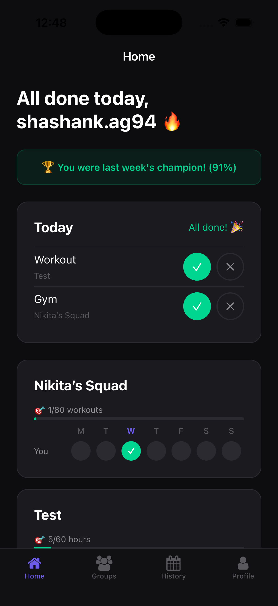
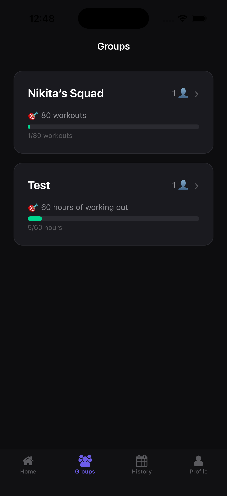
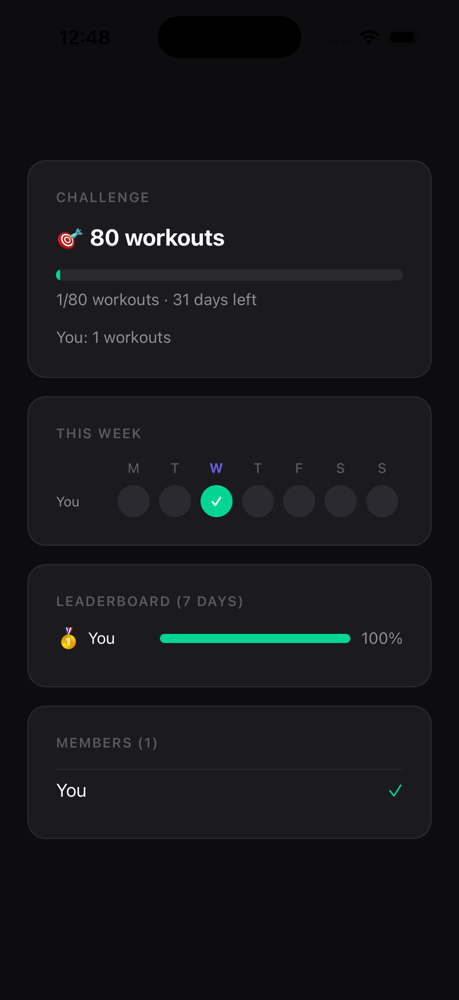
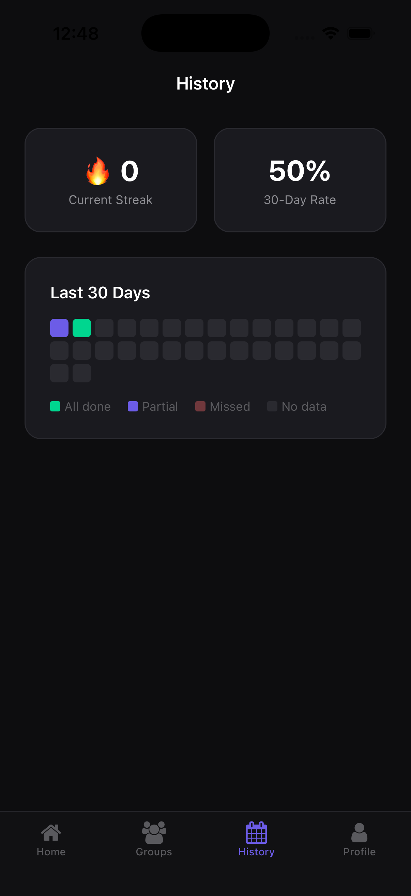

# Pact

**A social accountability app that makes sticking to your goals inevitable — because your friends are watching.**

## Why This Exists

92% of people fail their New Year's resolutions. Not because they lack motivation on day 1, but because motivation fades and nobody notices when they quit. The gym gets empty by February. The diet ends quietly. The habit dies in private.

**Accountability changes that.** Research shows that people who commit to someone else have a 65% chance of completing a goal — and that jumps to 95% with a specific accountability partner and regular check-ins (ASTC study).

But existing solutions are broken:
- **Fitness apps** track *you* — they don't involve your friends
- **Group chats** get noisy and people stop reading
- **Shared Notes** (what my friend group used) have no reminders, no streaks, no social pressure

Pact is built on one insight: **you won't skip the gym if your friends can see that you skipped the gym.**

## The Problem

Friend groups want to hold each other accountable to health and lifestyle goals, but every tool they try fails:

| What they try | Why it fails |
|---------------|-------------|
| Shared iPhone Notes | No reminders, no streaks, people forget to update |
| Group chat check-ins | Gets buried in other messages, no structure |
| Individual fitness apps | No social visibility, easy to ignore |
| Habit trackers | Solo experience, no accountability partner |

The result: goals die quietly. Nobody notices. Nobody cares.

## The Solution

Pact makes your commitment visible to the people whose opinion you care about.

**One tap to check in.** Every day, mark your goals as done or missed. Takes 3 seconds.

**Everyone sees everything.** Your group sees a weekly grid of who showed up and who didn't. No hiding.

**The group keeps you honest.** Nudges when you haven't checked in. Reactions when you do. Streaks that hurt to break.

## Key Features

| Feature | Why it matters |
|---------|---------------|
| **One-tap check-in** | Removes friction — 3 seconds, done |
| **Group visibility grid** | Social pressure through transparency |
| **Streaks with hard reset** | Loss aversion — missing one day costs you |
| **Nudges** | Friends can poke you when you're slacking |
| **Reactions (🔥👏)** | Positive reinforcement creates a second daily touchpoint |
| **Group Challenges** | Shared goals ("60 hours of working out this month") build collective identity |
| **Weekly winner** | Competition creates a weekly rhythm |
| **Streak milestones** | Variable rewards at 7, 14, 30 days |
| **Push notifications** | Solves the #1 problem: people forget |

## Target Metrics

| Metric | Target | Rationale |
|--------|--------|-----------|
| D1 retention | > 80% | Check-in mechanic should bring users back day 1 |
| D7 retention | > 60% | Streaks + social pressure sustain first week |
| D30 retention | > 40% | Group challenges + weekly winner create long-term rhythm |
| Daily check-in rate | > 75% of active users | Core engagement signal |
| Nudges sent/week | > 2 per group | Indicates social engagement |
| Avg streak length | > 7 days within first month | Habit formation threshold |
| Group size | 3-8 members | Sweet spot for accountability without noise |

## Product Decisions

| Decision | Rationale |
|----------|-----------|
| Binary goals (done/not done) | Reduces friction — no logging reps or minutes |
| Hard streak reset on miss | Creates real stakes — loss aversion drives behavior |
| Rest days don't break streaks | Prevents burnout, encourages sustainable habits |
| Reactions visible to group | Positive reinforcement loop — checking in gets rewarded |
| One active challenge per group | Focus > optionality |
| Tap-to-log contribution presets | Accuracy without friction (0.5, 1, 1.5, 2 hr buttons) |

## Roadmap

| Phase | Features | Status |
|-------|----------|--------|
| **P0 — MVP** | Auth, groups, goals, check-ins, grid, streaks, nudges | ✅ Shipped |
| **P1 — Engagement** | Reactions, streak milestones, weekly winner, challenges | ✅ Shipped |
| **P2 — Growth** | Apple HealthKit auto-check-in, invite deep links, onboarding optimization | 🔜 Next |
| **P3 — Retention** | Activity feed, levels/progression, weekly recap email | 📋 Planned |

## Tech Stack

| Layer | Choice | Why |
|-------|--------|-----|
| Frontend | React Native (Expo) | Single codebase, fast iteration, iOS-first |
| Backend | Firebase (Firestore) | Realtime sync, zero server management, free at scale |
| Auth | Firebase REST API | Compatible with Expo Go, no native dependencies |
| Notifications | expo-notifications | Local scheduling, no server needed for MVP |
| Routing | Expo Router (file-based) | Clean navigation, deep linking ready |

## Screenshots

<p align="center">
  
  
  
  
</p>

## Running Locally

```bash
npm install
npx expo start
```

Scan the QR code with Expo Go on your iPhone, or press `i` for iOS Simulator.

## Documentation

- [Screen Flows & Wireframes](docs/screen-flows.md)
- [Technical Design](docs/technical-design.md)

## Author

Built as a side project to solve a real problem with my friend group — and to demonstrate end-to-end product thinking from insight → BRD → design → shipped app.
